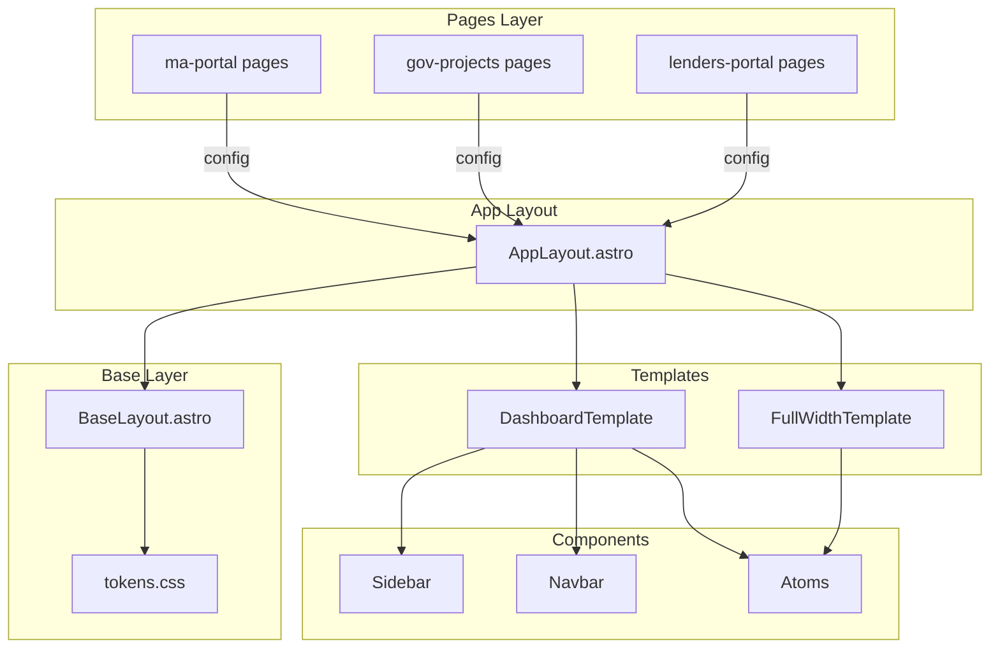
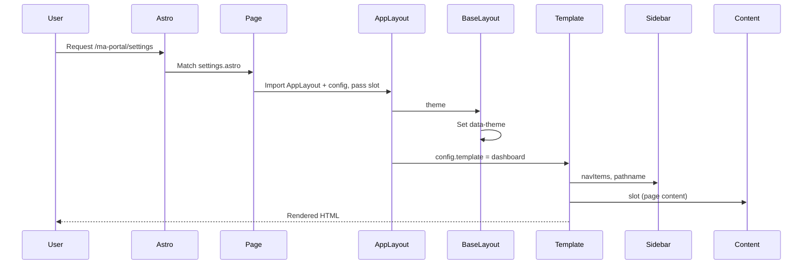

# Hubtel Multi-Project Platform Architecture

## Overall System Structure

The codebase follows a **layered architecture** where each layer has a single responsibility. Data flows downward: pages import AppLayout and the project config, then pass both to AppLayout. AppLayout applies the theme and picks the template (dashboard or fullwidth) from `config.template`. Components never know which project they belong to—they read CSS variables and accept props. _Source: `README.md`, `src/layouts/AppLayout.astro`_

## Major Components

### Pages (`src/pages/`)

Pure content. Astro file-based routing maps URLs to page files. Each page imports AppLayout and the project config, then passes both with content via slot. No per-project Layout files. _Source: `README.md`, `src/pages/`_

### App Layout (`src/layouts/AppLayout.astro`)

Single layout: reads `config.template` and renders BaseLayout + the matching React template (DashboardTemplate or FullWidthTemplate). Dispatches based on `config.template === "dashboard"` or `"fullwidth"`. _Source: `src/layouts/AppLayout.astro`_

### Base Layout (`src/layouts/BaseLayout.astro`)

Pure HTML shell: `<head>`, styles, `data-theme` attribute. Loads global.css (which loads tokens.css) and sets the theme on `<html>`. _Source: `README.md`_

### Templates (`src/templates/`)

React components that arrange page structure:

- **DashboardTemplate** — Sidebar + scrollable main area _Source: `src/templates/DashboardTemplate.tsx`_
- **FullWidthTemplate** — No sidebar, centered content _Source: `src/templates/FullWidthTemplate.tsx`_

### Components (`src/components/`)

Fully reusable atoms & organisms. Project-agnostic. Themed via CSS custom properties—no hardcoded colors. Organized by atomic design: atoms (Button, BrandLogo, Spinner, SidebarToggle), organisms (Sidebar, Navbar, UserInfo). _Source: `src/components/`, `README.md`_

### Config (`src/config/`)

- **types.ts** — `ProjectConfig`, `NavItem`, `ProjectBranding`, `TemplateName` _Source: `src/config/types.ts`_
- **utils.ts** — `getNavWithActive()`, `extendConfig()` for sub-project inheritance _Source: `src/config/utils.ts`_

### Theme Tokens (`src/styles/themes/tokens.css`)

CSS custom properties per project, activated by the `data-theme` attribute on `<html>`. Defines sidebar colors, primary, accent, content bg/text, etc. _Source: `src/styles/themes/tokens.css`_

## Dependencies

### Internal Dependencies

[NEEDS_INPUT: Other Hubtel services this frontend depends on]

### External Dependencies

| Package | Purpose | Version (approx) |
|---------|---------|------------------|
| astro | Static site generator, island architecture | ^5.7.12 |
| @astrojs/react | React integration | ^4.2.7 |
| react | UI library | ^19.1.0 |
| @tailwindcss/vite | Tailwind CSS v4 | ^4.1.6 |
| tailwindcss | Utility CSS | ^4.1.6 |
| @hubtel/react-ui | Hubtel design system | ^2.1.2 |
| @hubtel/react-icons | Icons | ^1.0.4 |
| @hubtel/shared-styles | Shared styles | ^0.3.0 |

_Source: `package.json`_

### Technology Stack

- **Language/Runtime:** JavaScript/TypeScript, Node.js (build) _Source: `package.json`, `tsconfig.json`_
- **Framework:** Astro 5, React 19 _Source: `package.json`_
- **Database:** None (static frontend)
- **Cache:** None
- **Message Queue:** None
- **Other:** Tailwind CSS v4, Vite _Source: `astro.config.mjs`_

## Architecture Diagrams

### System Architecture

### Component Interactions (Page Request)

## Data Flow

1. **URL → Page**: Astro file-based routing matches URL to `src/pages/{project}/.../*.astro`.
2. **Page → AppLayout**: Page imports AppLayout and project config, passes both with title and slot content.
3. **Config → AppLayout**: Page passes `config` (ProjectConfig) directly to AppLayout.
4. **AppLayout → Theme**: Sets `data-theme={config.theme}` on `<html>` via BaseLayout.
5. **AppLayout → Template**: Picks DashboardTemplate or FullWidthTemplate based on `config.template`.
6. **Template → Components**: Sidebar receives `navItems`, `pathname`, `branding` from config. Components read `var(--sidebar-bg)`, etc. from CSS.
7. **Config inheritance**: Sub-projects use `extendConfig(parent, overrides)` for shared branding/theme with overridden nav/path. _Source: `src/config/utils.ts`_

## Security Considerations

- Static/SSR frontend; no server-side secrets in this repo.
- [NEEDS_INPUT: Authentication flow — where is it handled? External provider?]
- [VERIFY_WITH_TEAM: Lendscore API keys — how are they managed? Client-side vs server-side?]
- External asset URLs (designs.hubtel.com) — ensure CORS/trust for assets.
