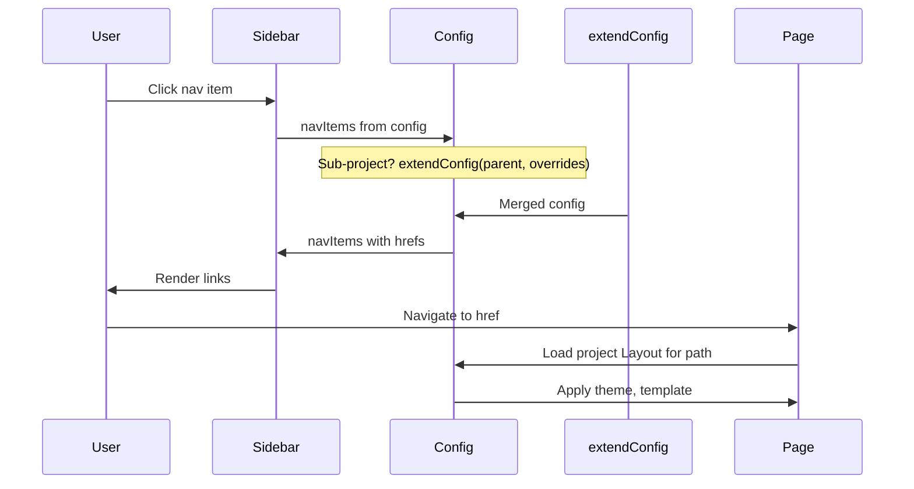

# Multi-Project Navigation Flow

## Description

This flow describes how users navigate between different projects (MA Portal, Gov Projects, Lenders Portal) and how sub-projects inherit configuration from parent projects. It covers the `extendConfig()` utility and nav item resolution. _Source: `README.md`, `src/config/utils.ts`, `src/projects/`_

## Actors

- **User** — Clicks nav links or enters URLs
- **Sidebar/Navbar** — Renders nav items from `config.navItems`
- **Project Config** — Defines basePath, navItems, theme, template
- **extendConfig()** — Merges parent config with child overrides for sub-projects
- **getNavWithActive()** — Marks the active nav item based on current pathname

## Flow Steps

1. **Parent project setup**: Gov Projects config defines basePath, theme, branding, navItems. _Source: `src/projects/gov-projects/assemblies/config.ts`_
2. **Sub-project inheritance**: Inspector Portal or Customer Portal use `extendConfig(parentConfig, { name, basePath, navItems, ... })` to override only what's needed. _Source: `README.md`, `src/projects/gov-projects/assemblies/inspector-portal/config.ts`_
3. **Nav resolution**: Layout passes `config.navItems` to Sidebar. For v4 sidebar, navItems are required. For v5, `v5SidebarProps.menu` may define structure. _Source: `src/config/types.ts`, `src/projects/ma-portal/config.ts`_
4. **Active state**: `getNavWithActive(pathname, navItems)` computes which nav item is active based on current URL. _Source: `src/config/utils.ts`_
5. **User clicks link**: Nav item has `href` (e.g., `/lendscore/lenders-portal/credit-report`). Browser navigates; Astro serves the new page; new project Layout and config are applied.
6. **Cross-project navigation**: Links can point to any path. If user goes from `/ma-portal/` to `/lendscore/lenders-portal/`, a different project's Layout and config are used.

_Source: `src/config/utils.ts`, `src/projects/`_

## Flow Diagram

## Edge Cases and Error Handling

- **Nested children navItems**: `NavItem` supports `children?: NavItem[]` for nested sub-nav (for future use). _Source: `src/config/types.ts`_
- **Badge counts**: `badgeCount` and `badgeColor` can be set on nav items (e.g., notification count). _Source: `src/config/types.ts`, `ma-portal config`_
- **Icon base path**: Lenders portal uses `iconBasePath` for nav icon SVGs. _Source: `src/projects/lenders-portal/config.ts`_
- **V4 vs V5 sidebar**: V4 uses `navItems` + `branding`; V5 uses `v5SidebarProps` with different structure. Config must satisfy the discriminated union. _Source: `src/config/types.ts`_

## Related Documentation

- Architecture: [../architecture/index.md](../architecture/index.md)
- Operations: [../operations/index.md](../operations/index.md)
