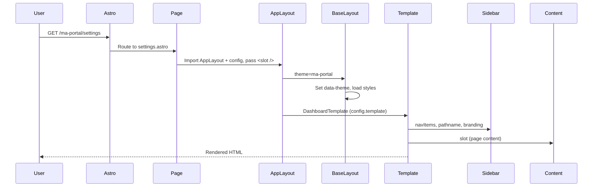

# Page Request Flow

## Description

This flow describes what happens when a user visits a URL within the platform (e.g., `/ma-portal/settings`). It covers Astro routing, layout resolution, template selection, and final rendering. _Source: `README.md`, `src/layouts/AppLayout.astro`, `src/pages/`_

## Actors

- **User** — Initiates the request by visiting a URL in the browser
- **Astro Router** — Matches URL to file-based route
- **Page** — Astro page component that imports AppLayout and project config, provides content
- **AppLayout** — Selects BaseLayout and template based on config
- **BaseLayout** — Sets HTML shell, theme attribute, loads styles
- **Template** — React component (Dashboard or FullWidth) that arranges Sidebar + content
- **Components** — Sidebar, Navbar, and other shared components

## Flow Steps

1. User navigates to a URL (e.g., `/ma-portal/settings`)
2. Astro matches the URL to `src/pages/ma-portal/settings.astro`
3. The page file imports AppLayout and the config from `src/projects/ma-portal/config.ts`
4. The page passes config to AppLayout
5. AppLayout wraps with BaseLayout — sets `<html data-theme="ma-portal">`, loads global.css and tokens.css
6. AppLayout reads `config.template` (e.g., `"dashboard"`) and renders `DashboardTemplate` with `client:load`
7. DashboardTemplate (React) renders:
   - Sidebar (reads `--sidebar-bg`, `--sidebar-text` from CSS vars; receives navItems, pathname from config)
   - Main content area (the page's `<slot />` content)
8. Astro/React hydrate where needed; final HTML is sent to the user

_Source: `README.md` "How It All Fits Together"_

## Flow Diagram

## Edge Cases and Error Handling

- **Unknown route**: Astro returns 404 if no matching page file exists.
- **Missing config**: If a page fails to pass config to AppLayout, AppLayout would receive undefined; pages must import and pass the project config.
- **Invalid template**: `config.template` must be `"dashboard"` or `"fullwidth"` per `TemplateName` type. _Source: `src/config/types.ts`_
- **Theme not in tokens**: If `config.theme` references a theme not defined in `tokens.css`, components will fall back to browser defaults or inherit from parent.

## Related Documentation

- Architecture: [../architecture/index.md](../architecture/index.md)
- Operations: [../operations/index.md](../operations/index.md)
