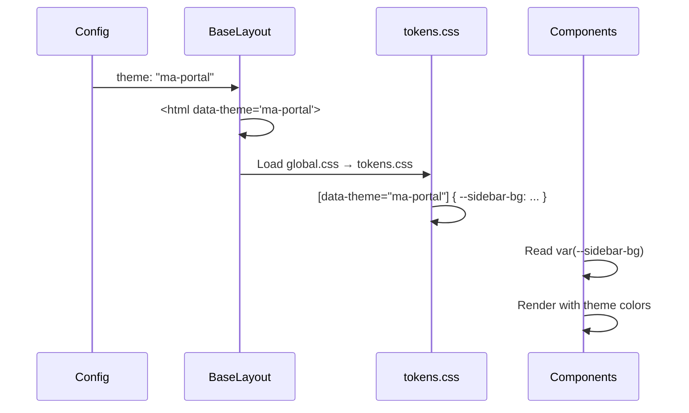

# Theme Application Flow

## Description

This flow describes how project-specific theming is applied across the platform. Themes are powered by CSS custom properties defined in `tokens.css` and activated via the `data-theme` attribute on `<html>`. _Source: `README.md`, `src/styles/themes/tokens.css`, `src/layouts/BaseLayout.astro`_

## Actors

- **Project Config** — Defines `theme` key (e.g., `"ma-portal"`, `"gov-projects"`)
- **BaseLayout** — Sets `data-theme` on `<html>` from config
- **tokens.css** — Defines CSS custom properties per theme selector
- **Components** — Consume tokens via `var(--sidebar-bg)`, `var(--primary)`, etc.

## Flow Steps

1. Page requests a project Layout (e.g., ma-portal) which passes config to AppLayout
2. AppLayout passes config to BaseLayout
3. BaseLayout sets `<html data-theme={config.theme}>` (e.g., `data-theme="ma-portal"`)
4. BaseLayout loads `global.css`, which imports `tokens.css`
5. In `tokens.css`, selectors like `[data-theme="ma-portal"]` define CSS custom properties:
   - `--sidebar-bg`, `--sidebar-active-bg`, `--sidebar-text`, etc.
   - `--primary`, `--primary-light`, `--accent`
   - `--content-bg`, `--content-text`
6. Components (Sidebar, Button, etc.) use `var(--sidebar-bg)` or Tailwind arbitrary values like `bg-[var(--primary)]`
7. When user navigates to another project (e.g., gov-projects), the new page's config has a different `theme`; BaseLayout sets the new `data-theme`, and components automatically pick up the new token values

_Source: `README.md` "Theming" section, `src/styles/themes/tokens.css`_

## Flow Diagram

## Edge Cases and Error Handling

- **Sub-projects sharing theme**: Sub-projects can use `theme: "gov-projects"` to inherit the parent's theme. _Source: `README.md`_
- **Missing theme in tokens**: If a theme key is used but not defined in tokens.css, properties will be undefined; components may show fallback or unstyled appearance.
- **Override in single page**: A page can override template to `"fullwidth"` while keeping the same theme. _Source: `README.md` FAQ_

## Related Documentation

- Architecture: [../architecture/index.md](../architecture/index.md)
- Operations: [../operations/index.md](../operations/index.md)
